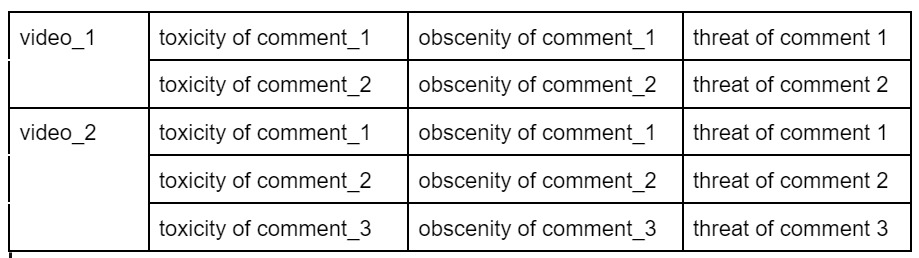
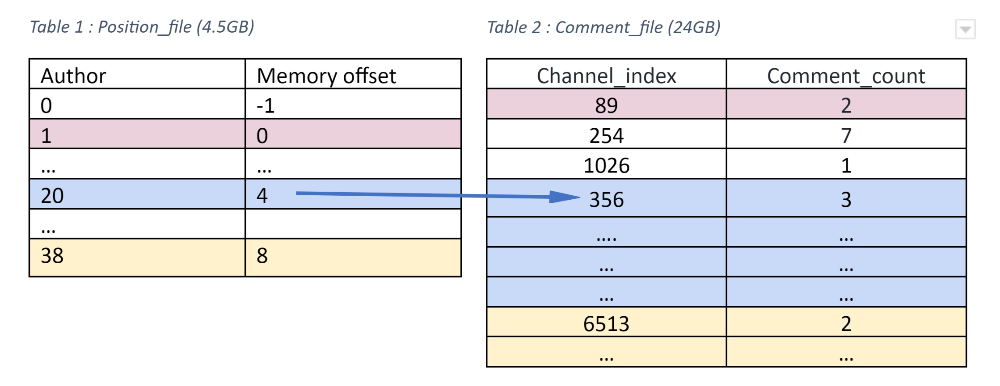
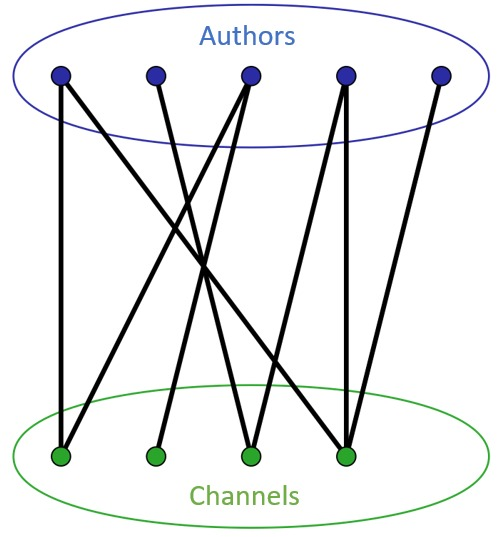
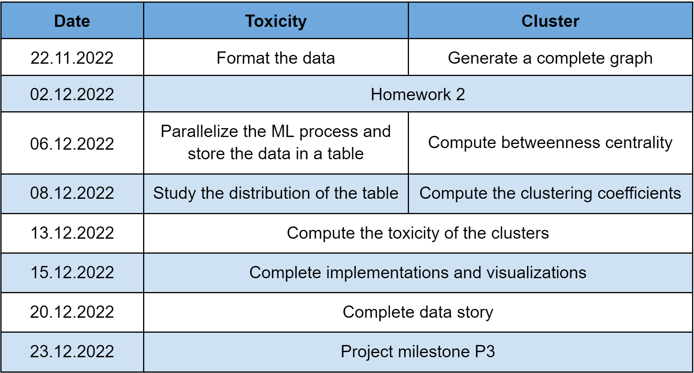

# Youtube’s Toxic Rabitholes

## Abstract

As reported by the [New York Times Magazine](https://www.nytimes.com/2017/08/03/magazine/for-the-new-far-right-youtube-has-become-the-new-talk-radio.html) in 2017, YouTube has become "the new Conservative talk radio" for the far right. Moreover, in 2019, [Kevin Roose depicted](https://www.nytimes.com/interactive/2019/06/08/technology/youtube-radical.html) "countless" stories of young men, looking for direction or distraction on YouTube, ending up "seduced by a community of far-right creators". The existence of a radicalization pipeline on Youtube was strongly suggested by the study [“Auditing Radicalization Pathways on Youtube”, by Ribeiro et al. (2020)](https://dlab.epfl.ch/people/west/pub/HortaRibeiro-Ottoni-West-Almeida-Meira_FAT-20.pdf). From there, we would like to enlarge the scope of this research by studying the toxicity of the comments and the co-commenting activities in far right channel videos. Doing so, we would like to see if these channels generate more toxic behavior and isolate users. Finally, this project could help find suitable solutions in order to reduce toxicity and attenuate far-right radicalization.

## Research questions
#### Toxicity
- How toxic are the Alt-lite, Intellectual Dark Web (I.D.W.) and Alt-right communities, compared to the control group Media?
- How does toxicity level evolve through time among these communities?
- Are toxicity scores and popularity correlated?
#### Clusters
- How influential are the clustered channels?
- How tight-knit are the channels of interest?
- How toxic are the found clusters?
    
## Proposed additional datasets 
We will base the list of far-right ideology channels on the study [“Auditing Radicalization Pathways on Youtube”](https://dlab.epfl.ch/people/west/pub/HortaRibeiro-Ottoni-West-Almeida-Meira_FAT-20.pdf), made in 2020 by Ribeiro et al. Moreover, for the toxicity level, we will use from their [data](https://drive.google.com/drive/folders/10r7nMK0-LAIfZws_jk2IpNdsWcrm-oOg?usp=share_link):
- The **vd folder**: description of the videos;
- The **cm folder**: comments on each video.  

For clusters, the [YouNiverse dataset](https://zenodo.org/record/4650046#.Y3eNQceZO3-) will be used, especially:
- `the youtube_comments.tsv.gz`;
- `df_timeseries_en.tsv.gz`.

## Methods
### Toxicity
To deal with the comments’ dataset size (20.6 Go), we can use a cluster. We'll also restrict our number of features by only keeping the comment string. If using a cluster doesn't work, we can use the Monte Carlo method.   

[`Detoxify`](https://github.com/unitaryai/detoxify) is a machine learning model which rates the toxicity of a comment on a scale from 0 to 1 (0 not at all, 1 very much). Furthermore,  it detects if it fits into these subcategories of toxicity: `severe_toxicity`, `obscene`, `identity_attack`, `insult`, `threat`, `sexual_explicit`. A comment is rated 1 in toxicity if it is a very ‘hateful, aggressive, or disrespectful that is very likely to make you leave a discussion or give up on sharing your perspective’. For our analysis, we will keep the toxic category and all of the subcategories as they are independently defined. We’ll store them in a dataframe where the first column is the name of the video and the other columns correspond to the category's score output by detoxify.

 

We’ll denote the `toxic_score_array` of a comment, its array output by detoxify through all categories.

We will compute the average of each category in the `toxic_score_array` over the comments for *each* of the videos. This allows us to generalize the term `toxic_score_array` to *videos*. Since `toxicity` is the main feature, that the other ones are subfeatures, and also that they are defined independently from each other, we choose to study them independently. The `toxic_score_array` of a *channel* contains the averages of the categories over all comments of its videos. 

Having these results in hand, we will use them to compare the toxicity of each of the extreme communities (Alt-right, Alt-light, I.D.W.) and of the control group (Media). 

We’ll check how the `toxic_score_array` of the videos is distributed per community. We’ll also investigate how the `toxic_score_array` evolves with regard to the popularity of a channel or video. We’ll define the popularity of a channel and of a video by its number of views (the more views, the more popular).
Finally we’ll do an analysis over time. We will study the evolutions of the averages (and the distribution) in the `toxic_score_array` of the videos/channels over time. To study this development over time, we’ll group our videos per month based on the upload date.

### Clusters
We will create a graph where:
- The nodes are the channel ID (given in the `youtube_comments.tsv.gz`)
- All edges are assigned an integer. This integer corresponds to the number of users that have commented on videos from both the edge's endpoints channels. If this number is 0, we'll delete the edge. 

We will first create a graph adjacency matrix for a weighted graph (using the data from 137k channel and 449M users) to study the interaction between channels and  communities. Its size will be 137’000 \* 137’000 \* 32 bits = 75GB, which is manageable using a server. If not, it’s possible to reduce the size by selecting the most relevant channels.

To create the matrix, the file `youtube_comments.tsv.gz` will be used. As this is a big data file (8.7 billion comments and over 200 GB uncompressed), the file can’t be open or used with a python script as it is.  To process this data, a C++ script is used to create 2 files:
1. **Comment_file**: a binary file which has `channel_index` (not ID but an integer representing the channel from the index of `df_timeseries_en.tsv.gz`) and a `comment_count` (it indicates how many times a user has commented on the videos of a particular channel);
2. **Location_file**: a file with the memory locations of where different authors start in the binary file (if in that index file at position 20 it says 4, that means that for author with id 4, his comments start at position 20 of that other file).

 

With these two tables a bipartite graph is constructed.
The goal is to collapse that graph into a weighted channel graph by building the adjacency matrix mentioned earlier.

 

To analyze the weighted graph, two measures will be used:
1. **Betweenness centrality**: measure of the importance of the channels. A channel with a high betweenness centrality has a lot of control in the network (`networkx` library on python);
2. **Clustering coefficient**: the local and global clustering coefficient are both going to be study, to see if the graph is a small-world network, at least locally.

## Proposed timeline

 

## Organization
Armelle & Anya: toxicity  
Bartul & Ariane: cluster
